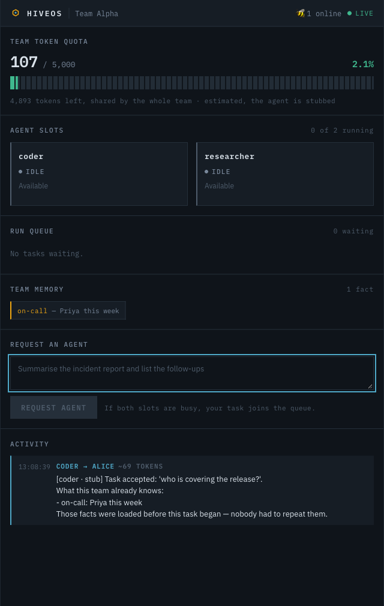

# HiveOS

**The OS scheduler for your team's shared AI budget.** Queue management for AI agents, visible to everyone in real time.

Teams sharing AI agents have no visibility into usage, no fairness mechanism for access, and no real-time governance over token spend — one heavy agentic task can drain a monthly budget in minutes and nobody sees it happen. Operating systems solved this for CPU fifty years ago with scheduling, quotas, and fair queueing. HiveOS applies that abstraction to team AI compute.

Built for the **First Commit** hackathon (WeMakeDevs × AWS), Ship It track.

**Live URL:** **https://main.dbavt8jr66qxx.amplifyapp.com** — opens cold, no setup, no sign-in.



---

## What it does

- One team shares a **token budget** and a pool of **agent slots**
- The budget meter is **identical on every member's screen** and updates live
- When all slots are busy, further requests **queue** with a real position
- A freed slot **auto-dispatches** the next queued task
- Agents share **team memory** — a fact saved by one member is known to the next member's agent
- The budget is an **enforced ceiling**, not a gauge — the server refuses to spend past it

**Status.** Everything above is live, deployed and verified against real AWS (49/49 end-to-end
checks — `scripts/ws_smoke.py`), with one honest exception:

> **The agent behind the slots is a stub.** Amazon Bedrock is blocked by an account-level quota
> restriction on this AWS account — 42 of 43 per-day token quotas sit at zero and are not
> adjustable — so no model is called. The stub returns composed text, and its token counts are
> **estimates** (`len(prompt + memory + response) / 4`) rather than billed usage. Every frame
> and the UI label them as estimates; the meter reads *"estimated, the agent is stubbed"*.
>
> Everything around it is real: the atomic slot claims, the FIFO queue and auto-dispatch, the
> WebSocket fan-out, the shared memory, the atomic token accounting, and the **enforced** budget
> ceiling — at 100% the agent is genuinely not invoked and not one token is spent.
>
> `_run_agent` in `backend/agent_runner/app.py` is the single seam a real model call drops into:
> it returns `AgentResult(text, tokens, estimated)`, and Bedrock fills the same three fields.

See `PROGRESS.md` for the full evidence and `ARCHITECTURE.md` decision 7 for the fallback.

---

## Architecture at a glance

```
Browser ──wss──► API Gateway WebSocket ──► Router Lambda ──► DynamoDB
                                                │                 ▲
                                                ▼                 │
                                               SQS ──► Agent Runner Lambda ──► Bedrock
```

React frontend on Amplify Hosting. Everything serverless, scaling to zero.

Full detail and the reasoning behind each choice: **`ARCHITECTURE.md`**.

---

## Documentation map

Read in this order:

| File | Read it for |
|---|---|
| **`CLAUDE.md`** | How to work on this project. **Start here.** |
| **`PROGRESS.md`** | Where things stand right now |
| **`BUILD_PLAN.md`** | The seven phases and what each must deliver |
| `PRD.md` | What the MVP is and is not |
| `ARCHITECTURE.md` | System design and every rejected alternative |
| `CONTRACT.md` | Schemas, protocols, and interfaces that must not drift |
| `DEPLOYMENT.md` | AWS setup, deploy commands, manual actions, troubleshooting |

**Fastest path to understanding:** `README.md` → `PROGRESS.md` → `ARCHITECTURE.md`.

---

## Setup

Requires: AWS CLI (configured), AWS SAM CLI, Docker (running), Node 20+, Python 3.11+.

```bash
brew install aws-sam-cli
aws configure                 # see DEPLOYMENT.md, Manual Action 1
```

Bedrock model access must be requested in the console before the agent works — `DEPLOYMENT.md`, Manual Action 2.

---

## Deploy

```bash
# Backend — always --use-container; local Python is newer than the Lambda runtime
sam build --use-container
sam deploy

# Frontend — resolves the WebSocket URL from the stack, builds, zips, publishes
./scripts/deploy-frontend.sh
```

`deploy-frontend.sh` is idempotent: it reuses the existing Amplify app and branch rather than
creating duplicates, and it fails loudly if the WebSocket URL did not make it into the bundle.

For local development against the deployed backend:

```bash
cd frontend
npm install
VITE_WS_URL="$(aws cloudformation describe-stacks --stack-name hiveos \
  --query "Stacks[0].Outputs[?OutputKey=='WebSocketURL'].OutputValue" --output text)" \
  npm run dev
```

Stack outputs (WebSocket URL, table name, queue URL):

```bash
aws cloudformation describe-stacks --stack-name hiveos \
  --query 'Stacks[0].Outputs' --output table
```

Verify the deployed backend actually behaves — two live clients, fan-out, and stale-connection cleanup, all against real AWS:

```bash
TOKEN_BUDGET=5000 ./scripts/seed.sh   # clean board; small budget so the meter visibly moves
pip install websockets
python scripts/ws_smoke.py            # 49 checks: backbone, scheduler, memory, ceiling
```

Close any browser tab pointed at the deployed URL first — the connection-leak checks assert the
table holds no `CONN#` rows, so a live browser fails four of them.

Full procedure, verification steps, and troubleshooting: `DEPLOYMENT.md`.

---

## Repository layout

```
backend/
  router/          Connection lifecycle, slot claiming, queueing, broadcast
  agent_runner/    SQS consumer, agent execution, token accounting, dispatch
  shared/          Slot scheduler, broadcast helper, memory tools, DynamoDB access
  shared/memory.py Team memory — MEMORY# rows, context loading, memory_updated
frontend/
  src/useHive.js   WebSocket client — owns all board state, reconnect, re-sync
  src/components.jsx  Quota strip, slot cards, run queue, activity log
  src/App.jsx      Entry gate, request form, board layout
scripts/           Seeding, WebSocket smoke test, frontend deploy
template.yaml      SAM — all AWS infrastructure
```

---

## Current MVP scope

**Built and deployed:** shared token meter · agent slots · FIFO queue with live position · auto-dispatch · shared team memory · enforced budget ceiling · public URL.

**Not built:** the Bedrock model call (account-blocked, see Status) and the 2D avatar canvas (cut — `BUILD_PLAN.md` Phase 5).

**Deliberately excluded:** authentication, multiple teams, game-engine graphics, token-level preemption, calendar/email integrations. See `PRD.md` and `ARCHITECTURE.md` for why.

---

## Built with

AWS Lambda · API Gateway WebSocket · DynamoDB · SQS · AWS SAM · Amplify Hosting · React + Vite

Amazon Bedrock is wired into the architecture and the IAM surface but is not yet invoked — see
**Status** above.

Developed with Claude Code as the implementation assistant.
